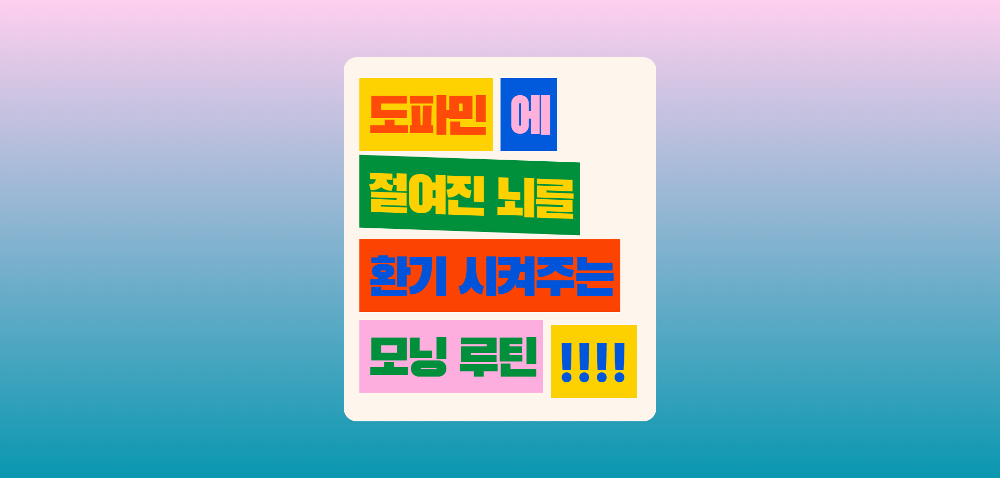
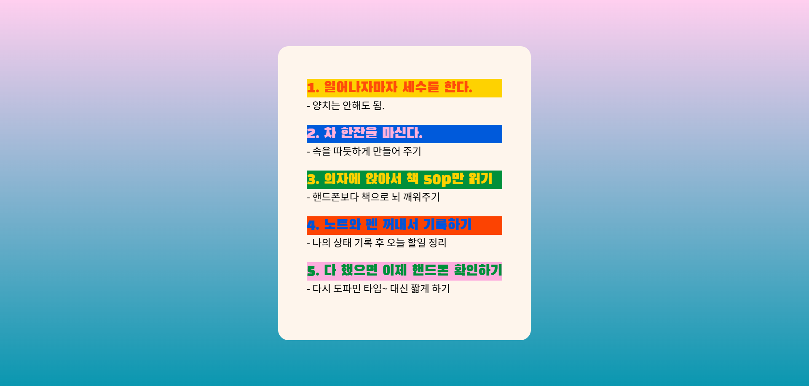

# 1-2. Flipping Card UI

## reference

## result

## 배운점

- 회전 효과 주기 위해서 설정하는 과정에서 대해서 익혔다.
- 레퍼런스 이미지 참고해서 마크업하는 과정이 재밌다.

## 아쉬운 점

- display: flex가 적용이 안되서 position을 이용한 중앙 정렬을 헀는데, 이 부분 더 공부해서 flex로 변경해 보자.
