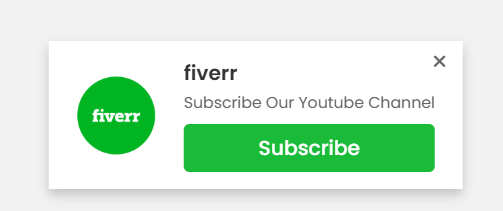

# 1-35. Web Push Toast Notification

## 출처

https://youtu.be/j8ljv_ps3H8?si=Z7ILi0aK_QaEvG2c

## Result




## Study

### 1. 버튼을 클릭하면 팝업이 뜨도록 하기

- 유튜브 채널 주소 + ?sub_confirmation=1 을 붙여서 a태그 href에 주소를 등록

```
<a href="https://www.youtube.com/@CodingLabYT?sub_confirmation=1" target="_blank">Subscribe</a>
```

### 2. keyframe을 이용한 애니메이션 만들기
