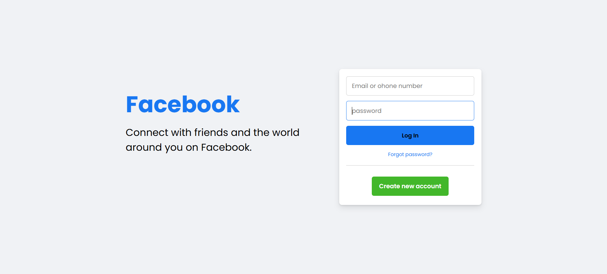

# 1-36. Login Pgae

## 출처

https://youtu.be/ekpJfZOQ7T0?si=cGc4FxHDKp13uapD

## Result

## Study

### 1. 🔗 a태그와 button 비교

| 구분        | `<a>` (Anchor) 태그                     | `<button>` 태그                     |
| ----------- | --------------------------------------- | ----------------------------------- |
| 핵심목적    | 이동                                    | 조작                                |
| 주요기능    | 다른페이지나 페이지 내 특정 위치로 이동 | form 제출, 팝업 열기, 인터랙션 실행 |
| 필수속성    | href 이동할 경로                        | type(button, submit, reset)         |
| 검색엔진    | 링크를 따라 페이지를 색인함             | 버튼의 클릭 동작을 수집하지 않음    |
| 키보드 동작 | Enter키로 이동                          | Enter와 space 키로 모두 실행        |

#### 🔗 `<a>` 태그를 써야 할 때 (이동)

- 로그인 페이지로 이동할 때
- 상세 보기 페이지로 넘어갈 때
- 외부 사이트로 연결할 때
- 페이지 내 특정 섹션(ID)으로 스크롤할 때

#### 🖱️ `<button>` 태그를 써야 할 때 (동작)

- 회원가입 양식을 제출할 때 (type="submit")
- 장바구니에 상품을 담을 때 (페이지 이동 없음)
- 모달(팝업) 창을 열거나 닫을 때
- 좋아요 버튼을 누를 때
