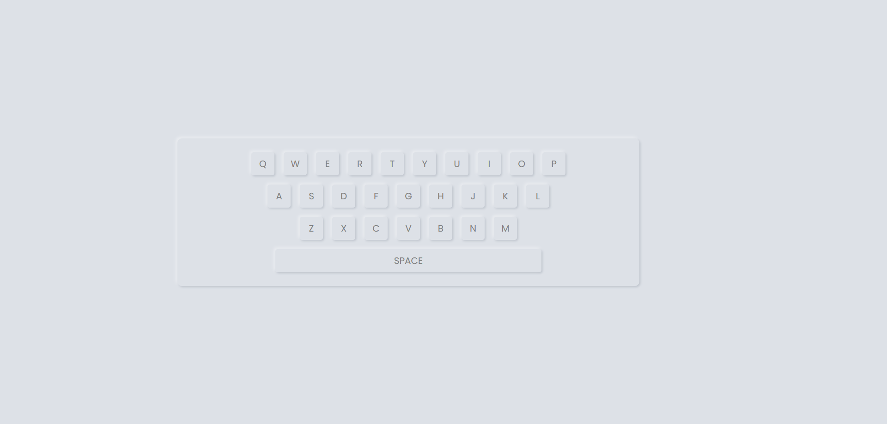

<h2>HTML</h2>

- wrapper를 담는 그릇은 .container
- .keys 를 다 담는 그릇은 .wrapper
- 총 4줄인데, 이거를 클래스 keys로 지칭해서 만듬
- 키보드 키는 input으로 만들고 type이 button, 값은 value로 넣기
- input의 높이 50px, 최대 너비 50px
- 마우스 클릭시 키의 글자 색과 배경 그림자 변화

<h2>궁금한 점</h2>

<h3>1. box-shadow 만드는 코드가 뭐였지.</h3>

`box-shadow: [가로위치] [세로위치] [흐림정도] [확장정도] [색상];`

<h3>2. min-width, max-width를 지정하는데 왜 최소, 최대 너비 설정해두는거임? 모니터에 따른 요소의 너비를 제한해 두는거임?</h3>

- 맞음
- 다양한 화면 크기(반응형 디자인)에서 디자인이 망가지지 않도록 보호막을 쳐주는 역할

<h3>3. css 작성할때 뎁스라고해야하나 부모 자식의 몇 뎁스까지 쓰는게 좋은건지 모르겠음.</h3>

- 2-3단계 이내를 유지하는것이 유지보구와 가독성 측면에서 중요

<h3>4. width를 60%로 지정해놓고 flex를 사용하니까 너비가 줄어드는데, 왜그러는거임?</h3>

- flex 레이아웃 안에서 width : 60%가 무시되고, 크기가 줄어드는 이유는 flex-shrink 속성때문임. 부모 요소 안에 자식 요소들이 가득 찾을 경우, 자식들이 설정된 너비를 유지하려다 부모 밖으로 빠져 ㅇ아가는 대신 스스로의 크기를 줄여서 부모 안에 맞추려고 함.

- 해결방법

  - flex-shrink : 0 으로 설정

  - flex-basis 사용하기

  - min-width: 60% 로 설정하기
