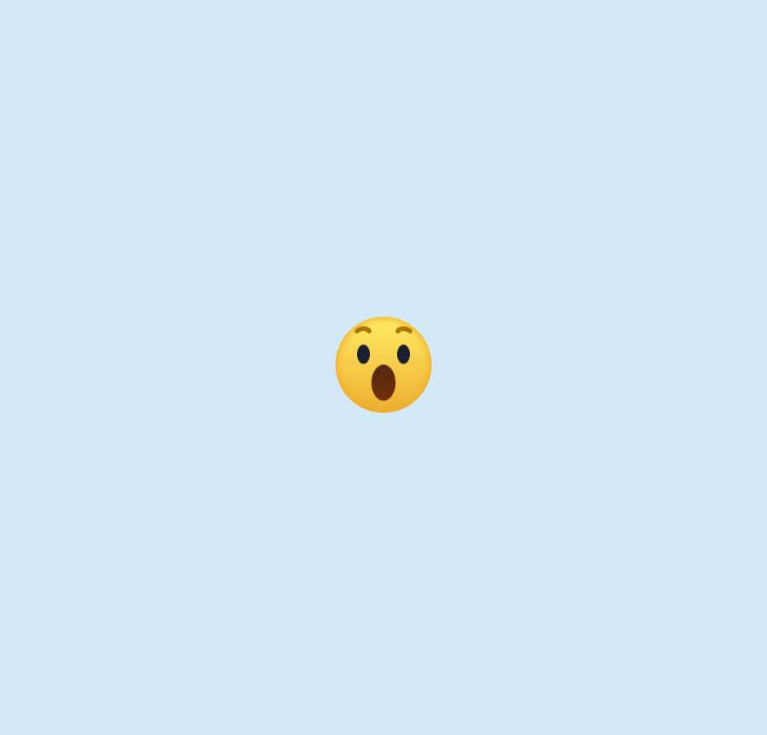

<h2>HTML </h2>

.center > .emoji > .emoji_face > .emoji_brow + .emoji_eye + .emoji_mouth

<h2>css</h2>
.center를 중앙 정렬하는 방법 => position: absolute를 이용해서 옮겼네

<h2>궁금한점</h2>

<h3>1. 박스쉐도우 문법 또 까먹었다. inset들어간 경우에 어떻게 쓰이는지 확인해봐</h3>

- box-shadow 기본 문법

속성 값은 보통 아래 순서대로 작성합니다.

```
box-shadow: [inset] [x-offset] [y-offset] [blur-radius] [spread-radius] [color];
inset: (선택) 안쪽 그림자를 만들 때 사용합니다.
x-offset: 가로 위치 (양수는 오른쪽, 음수는 왼쪽)
y-offset: 세로 위치 (양수는 아래쪽, 음수는 위쪽)
blur-radius: 그림자의 흐림 정도 (값이 클수록 퍼짐)
spread-radius: 그림자의 크기 (값이 클수록 그림자 자체가 커짐)
color: 그림자 색상
```

- 쉼표를 이용하면 안쪽 그림자와 바깥쪽 그림자를 동시에 줄 수 있다.

```
box-shadow:
inset 2px 2px 5px rgba(0,0,0,0.2), /_ 안쪽 상단 그림자 _/
5px 5px 15px rgba(0,0,0,0.1); /_ 바깥쪽 하단 그림자 _/
```

<h3>2. position: absolute의 의미에 대해서 잘 모르네</h3>

- 이 요소는 일반적인 문서 흐름을 탈출시켜 자유롭게 움직일 수 있는 상태로 만든다고 하네

- 이 코드를 쓰면 let, top 같은 좌표값을 사용할 수 있게 됨

<h3>3. 요소를 중앙으로 정렬시키는 방법에 대해서 flex가 익숙해 져있는거 같음. position을 쓰는 방법도 알아두자.</h3>

```
position: absolute;
top: 50%;
left: 50%;
transform: translate(-50%, -50%);
```

<h3>4. @ keyfreames 애니메이션 이름</h3>
   
   ```
   @keyframes mouth {
   10%,
   30% {
   width: 20px;
   height: 20px;
   left: calc(50% - 10px);
   }
   50%,
   70% {
   width: 30px;
   height: 40px;
   left: calc(50% - 15px);
   }
   75%,
   100% {
   height: 45px;
   }
   }
   ```

| 구간 (진행률) | 주요 변화 내용                | 시각적 효과                                       |
| ------------- | ----------------------------- | ------------------------------------------------- |
| 0% ~ 10%      | 초기 상태에서 설정값으로 변화 | 입 모양이 잡히기 시작함                           |
| 10% ~ 30%     | width: 20px, height: 20px     | 작고 동그란 입 모양 유지                          |
| 50% ~ 70%     | width: 30px, height: 40px     | 입이 가로/세로로 크게 벌어짐 (웃거나 놀라는 표정) |
| 75% ~ 100%    | height: 45px                  | 입이 세로로 더 길게 늘어나며 마무리               |

**💡 핵심 포인트 해석**

1. 중앙 정렬 유지 (left: calc(50% - ...))  
   입의 너비(width)가 바뀔 때마다 중앙을 맞추기 위해 left 값을 계산하고 있습니다.
   너비가 20px일 때는 절반인 10px을 빼주고, 30px일 때는 15px을 빼주는 식이죠. 아까 질문하신 translate 속성을 쓰면 이 계산 없이 left: 50%; translate: -50% 0;만으로 훨씬 편하게 구현할 수 있습니다.
2. 구간 유지 (10%~30%, 50%~70%)  
   쉼표(,)로 퍼센트를 묶어준 것은 그 사이 시간 동안 **모양을 유지(Hold)**하라는 뜻입니다. 덕분에 입이 쉴 새 없이 움직이는 게 아니라, 특정 표정에서 잠시 멈췄다가 변하는 리듬감이 생깁니다.
3. 마지막 변화 (75%~100%)  
   이 구간에서는 width나 left 값에 대한 언급이 없으므로, 이전 단계(70%)의 값을 그대로 가져가면서 높이(height)만 40px에서 45px로 살짝 더 늘어납니다.
   어렵다고 느끼는 이유
