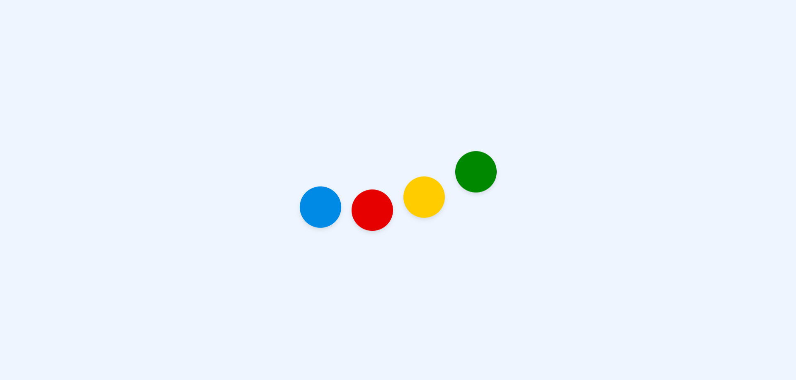

<h2>HTML</h2>
.wrapper > .dot\*4

<h2>CSS</h2>
배경색 : #eef5fe;

공 색깔 : #008ae6; #e60000; #ffcc00; #008800;

애니메이션

- 1s ease-in-out infinite alternate;

- 0% : 위로 10px 올라감

- 100% : 아래로 5px 내려감

- 각각의 공에 애니메이션 딜레이를 걸어서 공이 순서대로 움직이는 효과를 줌(-0.25s, -.5s, -.0.75s, -1s)

<h2>궁금한점</h2>

<h3>1. 애니메이션에서 alternate은 무슨의미지</h3>

: 움직임을 부드럽고 자연스럽게 반복시키기 위해서

: 보통 애니메이션은 0%에서 시작해 100%에서 끝나면 다시 0%로 뚝 끊기듯 돌아가는데, alternate는 이 흐름을 왕복 운동으로 바꿔줍니다.

: 장점 및 이유

- 부드러운 왕복 효과: 애니메이션이 0% → 100%로 진행된 후, 다시 100% → 0%로 역방향 재생됩니다. 덕분에 시각적으로 끊김 없이 자연스럽게 연결됩니다.
- 코드의 효율성: 왕복하는 동작을 만들기 위해 0%, 50%, 100% 지점을 일일이 계산해서 키프레임을 짤 필요가 없습니다. 0%와 100%만 정의하고 alternate만 주면 자동으로 중간 과정을 만들어줍니다.
- 자연스러운 루프: 심박수 그래프, 숨 쉬는 듯한 아이콘(pulsing), 왔다 갔다 하는 진자 운동 등을 구현할 때 필수적입니다.

: 주의할 점

- alternate가 제대로 작동하려면 animation-iteration-count가 2 이상이거나 infinite여야 합니다. 한 번만 실행되도록 설정하면 역방향으로 돌아올 기회가 없기 때문입니다.

<h3>2. 초에 -를 사용할수가 있네. -.25s는 어떻게 동작을 하는거지?</h3>

: 애니메이션이 이미 0.25초 동안 진행된 상태에서 시작하라는 의미

: 양수 딜레이 vs 음수 딜레이

- animation-delay: 0.25s; (양수)  
  화면이 로드되고 나서 0.25초를 기다린 뒤에 애니메이션이 0% 지점부터 시작합니다.
- animation-delay: -0.25s; (음수)  
  기다리지 않고 즉시 시작합니다.
  하지만 시작 시점이 0%가 아니라, 전체 애니메이션 중 0.25초가 지난 시점의 모습부터 보여줍니다.
