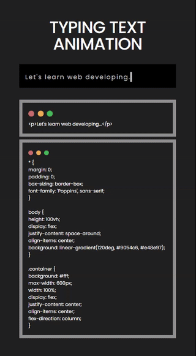

# 1-11. Website With Typing Text Animation

## 출처

https://youtu.be/Ca2Goj7Aoc4?si=me9EpypXrrcG27iL

## Goal


## Result



## Study

### 1. html 문서에서 태그도 보이게 하는 방법

- **HTML 엔티티 사용하기**  
   특수 문자를 HTML 엔티티로 변환하여 출력할 수 있습니다. 예를 들어, <와 >를 각각 `&lt;`와 `&gt;`로 바꿉니다.  
   `<p>&lt;p&gt;Let's learn web developing...&lt;/p&gt;</p>
`

### 2. 텍스트 간의 줄 간격을 조절할때 line-height

- 값의 유형  
  : 숫자 -> 예를 들어 1.5는 폰트크기의 1.5배 만큼의 줄 간격  
  : 깋이 단위 -> 20px는 20px의 고정된 줄 간격  
  : 백분율 -> 150%는 폰트 크기의 150%에 해당하는 줄 간격

### 3. @ketframes를 이용한 애니메이션 만들기

- **문법**

  ```
  @keyframes 애니메이션이름 {
    0% {
        /* 시작 스타일 */
    }
    50% {
        /* 중간 스타일 */
    }
    100% {
        /* 끝 스타일 */
    }
  }
  ```
