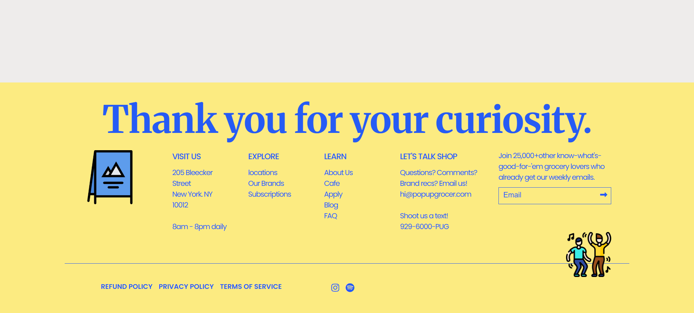

# 1-13. Responsive Website Footer Design

## goal


## Result



## Study

### 1. flex 아이템 조정하기

**(1) flex-grow 속성**

- 플렉스 항목이 나머지 플렉스 항목에 비해 얼마나 커질지를 지정
- 값은 숫자여야하며, 기본값은 0
- 예시)  
  세번째 플렉스 항목을 다른 플렉스 항목보다 8배 키우기

```
<div class="flex-container">
  <div style="flex-grow: 1">1</div>
  <div style="flex-grow: 1">2</div>
  <div style="flex-grow: 8">3</div>
</div
```

**(2) flex-shrink**

- 플렉스 항목이 나머지 플렉스 항목에 비해 얼마나 줄어들지를 지정
- 값은 숫자여야 하며, 기본값은 1
- 예시)  
  세번째 플렉스 항목이 다른 플렉스 항목만큼 줄어들지 않도록 하기

```
<div class="flex-container">
  <div>1</div>
  <div>2</div>
  <div style="flex-shrink: 0">3</div>
  <div>4</div>
  <div>5</div>
  <div>6</div>
  <div>7</div>
  <div>8</div>
  <div>9</div>
  <div>10</div>
</div>
```

**(3) flex-basis**

- 플렉스 항목의 초기 길이를 지정
- 예시)  
  세번째 플렉스 항목의 초기 길이를 200픽셀로 설정

```
<div class="flex-container">
  <div>1</div>
  <div>2</div>
  <div style="flex-basis: 200px">3</div>
  <div>4</div>
</div>
```

**(4) flex**

- flex-grow, flex-shrink, flex-basis의 약어
- 예시)  
  세번째 플렉스 항목을 확장 불가능, 축소 불가능으로 설정하고, 초기 길이를 200픽셀로 설정

```
<div class="flex-container">
  <div>1</div>
  <div>2</div>
  <div style="flex: 0 0 200px">3</div>
  <div>4</div>
</div>

```

## 아쉬운 점

- 물결 모양 선 만드는 방법 모르겠음. 추후에 공부해서 업데이트 하겠음
