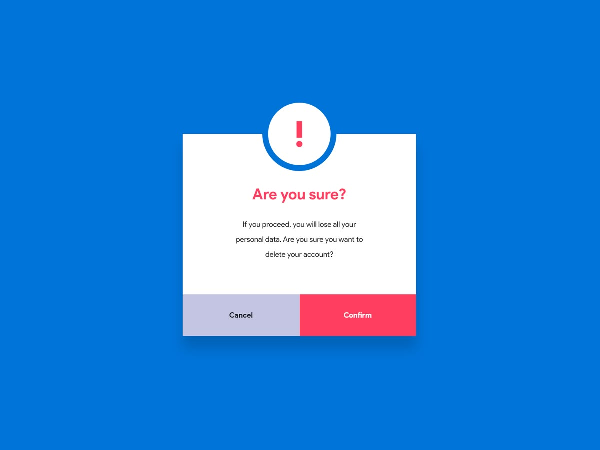

# 1-23. Popup Modal Box

## Goal

## Result

## Study

### 1. width: 100%로 설정을 해도 왜 꽉 차지 않을까?

1. 먼저 width: 100% 의 의미를 생각해보자  
   : 부모 요소의 콘텐츠 영역을 100% 채우자 라는 의미

2. 영역이 채워지지 않는 이유  
   2-1. box-model  
   : css에서 요소의 너비를 계산할 때에 padding이나 border가 포함되지 않는데, 콘텐츠의 영역을 100%로 두고 여기에 padding이나 border를 추가하면 부모 영역을 넘어가게 됨  
   -> 해결 방법 : box-sizing을 border-box로 설정을 하여, width 값에 padding과 border가 포함해서 계산되도록 한다.

   2-2. display 속성이 inline인 경우  
   : 인라인 요소는 width를 100%로 줘도 무시가 된다.  
   -> 해결방법 : block이나 inline-block으로 속성값을 변경해 준다.

   2-3. 부모 요소의 margin이나 padding 때문에 발생  
   : 만약에 부모 요소에 마진이나 패딩이 있는 경우에는, 자식 요소의 100%는 부모 요소의 마진이나 패딩을 제외한 콘텐츠 영역을 기준으로 계산이 된다.

   2-4. inline-block 요소 사이의 공백 문자
   : inline-block을 사용했을 때, html 문서 상의 공백 문자가 있을 경우에는 그게 실제 화면에서 작은 공백으로 나타날 수 있음  
   -> 해결방법 1 : inline-block 사이의 공백을 제거 (가독성 떨어짐) -> 해결방법 2 : 부모 요소에서 font-size를 0으로 설정을 하고, 자식 요소에서 font-size를 재지정

### 2. 부모요소의 너비에 대해, 자식 요소의 너비를 50%로 설정을 해도 두줄로 표시되는 이유

1. inline-block 요소 사이의 공백 문자  
   : HTML 코드 상에서 요소들 사이에 스페이스나 엔터 같은 공백이 있으면 그게 실제 화면에서 아주 작은 여백으로 렌더링됨
2. box-sizing 문제  
    : 자식 요소에 padding이나 border가 있다면 width: 50%는 콘텐츠 영역만 50%로 잡고, padding과 border가 추가되면서 실제 너비가 50%를 넘어가 버리게 됨. 그럼 50% + 50% + padding/border가 100%를 초과해서 다음 줄로 내려오는 거지.  
   => 해결 방법
   1. Flexbox를 사용  
      : 부모 요소에 display : flex;를 지정하면, 자식 요소들이 한 줄에 자연스럽게 배치 된다.
   2. inline-block를 사용해야 하는 경우에는
      : HTML 문서의 공백을 제거하면 되는데, 이때 가독성이 떨 어질 수 있음.
      : 그럼 부모 요소의 font-size를 0으로 설정을 하고, 자식 요소에서 font-size를 재지정한다.
   3. float  
      : 옛날 방식이라 비추
