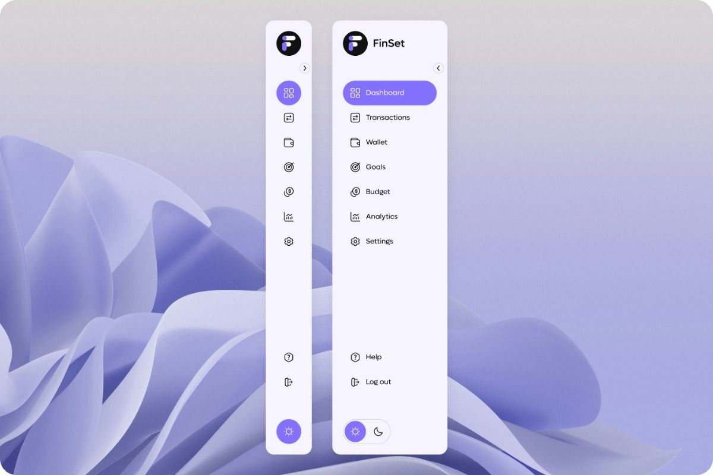

# Sidebar

## Goal

## Result

## Study

**1. line-height와 vertical-align을 이용한 텍스트 수직 중앙 정렬**
line-height|vertical-align: middle|
|---|---|
|컨테이너의 높이와 동일하게 설정하면, 텍스트가 수직 중앙 위치|아이콘의 수직 중앙 정렬 위해 사용|
|텍스트가 한줄일때 효과적|인라인 요소에서 수직 정렬을 조정하는 데 유용|

## 아쉬운 점

1. css로 표현할 때 자식 아이템 정렬할 때 헷갈리는 거 같음. flex로 하는데, 너무 많이 남발하는 느낌도 있음

2. light 버전, dark 버전도 만들고 싶었는데, 그거는 자바스크립트로 구현해야 해서 좀 더 공부해서 채울 예정

3. 목표 이미지처럼 클릭 전에는 아이콘만 보이도록 하고, 클릭시 텍스트가 보이며 더 자세히 보이도록 구현을 하고 싶었는데 그러지 못해서 아쉽다. 이것도 차차 다른 실습 통해서 배우면 업데이트 하는 방향으로 하자.

4. margin과 padding으로 콘텐츠 위치를 조정하고 있는데, 어떨 때 margin으로 하고 어떨 때 padding으로 해야하는 지 잘 모르겠음

5. 전체적으로 css 문법을 요즘 어떻게 사용하는지 궁금함.
