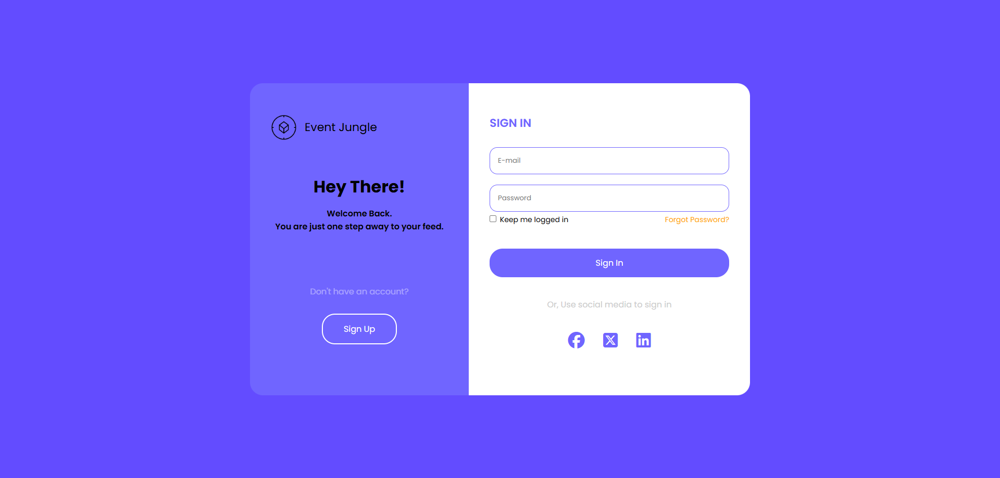

# 1-5. Responsive Login Form

## Goal

## Result

## Study

**1. :focus와 :active의 차이**

**- focus**  
 : <u>사용자가 요소를 클릭하거나 키보드로 탐색할 때 해당 요소가 포커스된 상태</u>를 나타냄  
 : 입력필드, 버튼, 링크 등과 같이 사용자가 상호작용할 수 있는 요소에 적용  
 : 주로 텍스트 입력 필드나 버튼에 대해 시각적으로 강조를 주어 사용자가 현재 어떤 요소에 포커스하고 있는지 알리기 위해 사용

**- active**  
 : <u>사용자가 요소를 클릭하고 있는 동안</u> 그 요소가 활성화된 상태를 나타냅니다. 마우스 버튼을 누르고 있는 동안 적용  
 : 버튼, 링크 등 클릭 가능한 요소에 적용  
 : 버튼이나 링크가 클릭되는 동안 시각적을 변경하여 사용자가 버튼을 클리갛고 있다는 피드백을 제공

## 아쉬운 점

1. 이메일이랑 비밀번호 입력란에 focus 했을 때, 위에 Email이라는 표시가 들어가도록 border에 들어갔어야 하는데 아직 할 줄 몰라서 넘어감. 예전에 실습했던거 같은데 나중에 업데이트 하도록 하겠음
