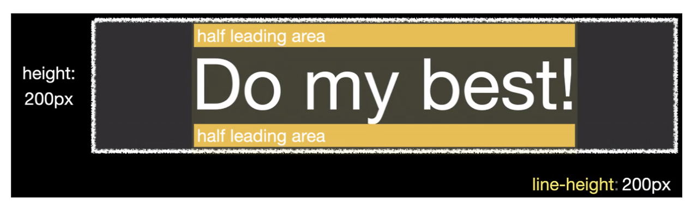

# 1-10. Vertical Tab Design

## 출처

https://www.youtube.com/watch?v=DTtPuBcuYF8&list=PLImJ3umGjxdD3ov2lwg0SM5rxz5v9FjOf&index=11

## Result

<image src="img/result.png">

## Study

### 1. line-height와 height를 이용한 텍스트 수직 중앙 정렬



### 2. input과 label 연결해서 탭 이동하는 효과

```
<input type="radio" name="indicator" checked id="home">

<label for="home" class="home">
    <i class="fas fa-home"></i>
    <span class="topic">Home</span>
</label>

```

label의 for="home" 속성은 이 레이블이 id가 home인 입력 요소와 연결되어 있음을 나타냅니다. 사용자가 이 레이블을 클릭하면 해당 라디오 버튼이 선택됩니다.

### 3. #home:checked ~ .list .home 의미

- <span style="background: Yellow; font-weight: bold">#home:checked</span>
  : ID가 home인 체크박스가 체크된 상태를 의미합니다.
- <span style="background: Yellow; font-weight: bold">~</span>
  : 형제 선택자. #home 체크박스와 같은 부모 요소를 가진 모든 형제 요소 중에서 선택합니다.
- <span style="background: Yellow; font-weight: bold">.list .home</span>
  : 클래스가 list인 요소 안에 있는 모든 <label> 요소를 선택합니다.
  : ID가 home인 체크박스가 체크된 상태일 때, 같은 부모 요소를 가진 모든 형제 요소 list 클래스를 가진 요소 안에 있는 .home 요소에 스타일을 적용한다는 의미

### 4. max-width, min-width를 사용하는 이유가 반응형 떄문인건 알겠는데 그래도 잘 모르는 거 같음.

- **max-width**  
  : 요소가 특정 너비를 넘지 않도록 제한할 때 사용합니다.

  - 사용 상황  
    : <u>요소가 너무 넓어지는 것을 방지</u>하고 싶을 때 사용합니다.  
    : 반응형 디자인에서 콘텐츠가 너무 넓어져 가독성이 떨어지는 것을 방지할 때 유용합니다.  
    : 예를 들어, 이미지나 텍스트 블록이 특정 너비 이상으로 늘어나지 않도록 하고 싶을 때 사용합니다.

- **min-width**  
  : 요소가 특정 너비 이하로 줄어들지 않도록 보장할 때 사용합니다.
  - 사용 상황  
    : <u>요소가 너무 좁아져서 내용이 잘리거나 가독성이 떨어지는 것을 방지</u>하고 싶을 때 사용합니다.  
    : 반응형 디자인에서 특정 콘텐츠가 항상 보여야 하거나, 특정 레이아웃이 유지되어야 할 때 유용합니다.

### 5. input의 name 속성이 사용되는 경우

- **폼 데이터 전송**  
  : 사용자가 입력한 데이터를 서버로 전송할 때, name 속성은 해당 데이터의 키 역할을 합니다. 서버는 이 키를 통해 어떤 데이터를 수신했는지를 식별할 수 있습니다.

- **서버 측 처리**  
  : 백엔드에서 폼 데이터를 처리할 때, name 속성을 사용하여 각 입력 필드의 값을 구분하고 처리합니다.

- **라디오 버튼 그룹화**  
  : 같은 name 값을 가진 여러 개의 라디오 버튼이 있을 경우, 사용자는 하나의 옵션만 선택할 수 있습니다. 이를 통해 관련 있는 선택지를 그룹화할 수 있습니다.

- **자바스크립트에서 접근**  
  : 클라이언트 측에서 자바스크립트를 사용할 때, name 속성을 통해 특정 입력 요소를 쉽게 찾을 수 있습니다.

### 6. input의 type 속성 중 radio와 checkbox의 차이

**(1) 선택 방식**

- radio  
  : 여러 옵션 중에서 하나만 선택할 수 있도록 하는 입력 방식입니다. <u>같은 name 속성을 가진 라디오 버튼들 중에서 하나만 선택</u>할 수 있습니다. 선택된 버튼이 있으면 다른 버튼을 선택하면 이전 선택이 해제됩니다.
- checkbox  
  : <u>여러 옵션 중에서 여러 개를 선택할 수 있도록 하는 입력 방식</u>입니다. 각 체크박스는 독립적으로 선택할 수 있으며, 여러 개를 동시에 선택하거나 모두 선택 해제할 수 있습니다.

**(2) 용도**

- radio  
  : 사용자에게 여러 개의 상호 배타적인 옵션 중에서 하나를 선택하도록 요구할 때 사용됩니다. <u>예를 들어, 성별 선택(남성/여성)과 같은 경우에 적합</u>합니다.
- checkbox  
  : 사용자에게 여러 개의 옵션 중에서 원하는 항목을 자유롭게 선택하도록 할 때 사용됩니다. <u>예를 들어, 관심 있는 주제를 선택하는 경우에 적합</u>합니다.

**(3) UI 표현**

- radio  
  : 일반적으로 <u>원형 버튼으로 표시</u>되며, 선택된 상태는 원 안에 점으로 표시됩니다.
- checkbox  
  : <u>정사각형 박스로 표시</u>되며, 선택된 상태는 체크 표시로 나타납니다.

## 발전시킬 부분

1. 반응형으로 만들기
