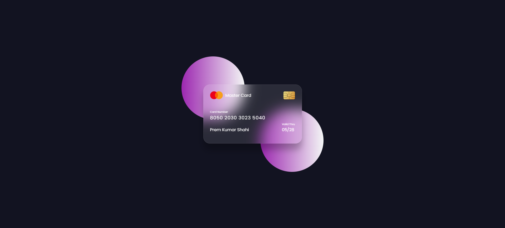

# 1-2. Flipping Card UI

**출처**  
https://www.youtube.com/watch?v=20Qb7pNMv-4&list=PLImJ3umGjxdD3ov2lwg0SM5rxz5v9FjOf&index=2

**참고**  
https://fonts.google.com/
구글웹폰트 poppins

### Goal

### 이해하기

**1. position 속성**  
(1) static  
: 문서의 흐름에 따라 요소를 위치, top, bottom, left, right로 설정 할 수 없음

(2) relative  
: 문서의 흐름에 따라 요소를 위치하며, 원래의 위치에서 부터 이동이 가능  
: top, left, right, bottom으로 설정 가능

(3) absolute  
: 자기 자신과 가장 가까운 조상을 기준으로 위치를 설정
: static을 제외한 값이 조상 기준점으로 표현
: 만약에 없다면 body가 기준이 됨

(4) fixed  
: 스크롤을 해도 위치가 변경되지 않음

(5) sticky  
: 특정 스크롤에 도착하면 relative 가 sticky로 변경

**2. flex 속성 중 justify-content 속성값**  
(1) space-betweeen
: 맨 앞뒤의 요소를 양끝에 붙이고, 사이 간격을 동일

(2) space-evenly  
: 요소들 사이와 양끝의 여백이 모두 동일

(3) space-around  
: 요소들 사이와 양 끝에 여백이 있으며, 요소 간의 간격이 동일
