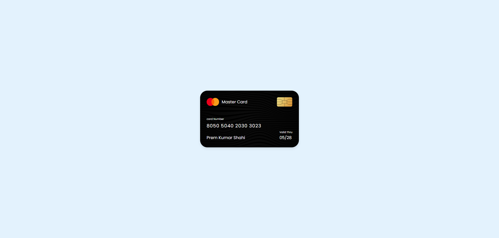

# Card Design

## 출처

https://www.youtube.com/watch?v=pLwEasHW3_I&list=PLImJ3umGjxdD3ov2lwg0SM5rxz5v9FjOf&index=3

## Goal

## Study

**1. max-width와 width를 같이 설정하는 이유**  
: 웹 디자인에서 요소의 크기를 보다 유연하게 조정하고, 다양한 화면 크기에서 적절하게 표시되도록 하기 위해서 설정

- width  
  : 정확한 너비 설정  
  : 고정형 레이 아웃으로, 사용자가 브라우저 창의 크기를 조정할 때 요소의 너비가 변경되지 않으므로 특정 디자인을 유지하는데 유리

- max-width  
  : 최대 너비 설정  
  : 유연한 레이아웃으로 반응형 디자인에 유용하며, 화면 크기에 따라 요소의 너비가 자동으로 조정  
  : 예를 들어서 width : 100%, max-width: 800px로 설정하면, 요소는 화면의 100% 너비를 차지하지만 최대 800px을 넘기지 않게 됨.

: 두 속성을 같이 사용하면, 요소의 너비를 특정 값으로 설정하면서도, 화면 크기에 따라 유연하게 반응하도록 할 수 있으며, 다양한 장치에서 적절하게 표시되도록 하여 사용자 경험을 향상 시킬 수 있음
