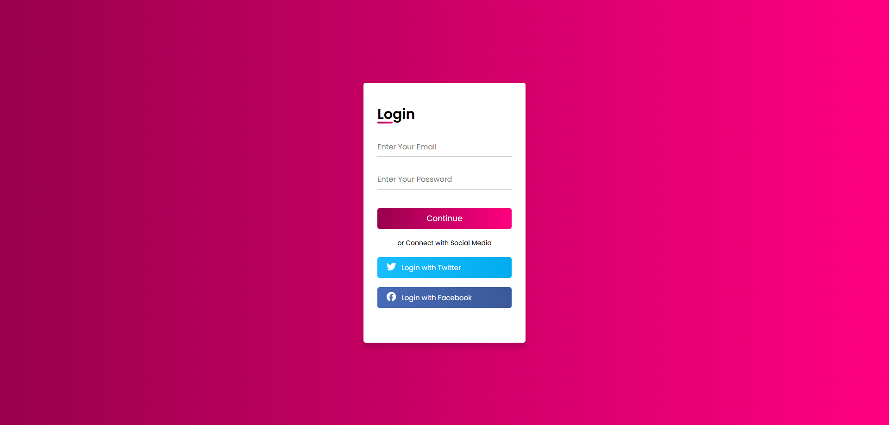

# 1-12. Animated Login Form

## 출처

https://www.youtube.com/watch?v=fGtB9VRHQb0&list=PLImJ3umGjxdD3ov2lwg0SM5rxz5v9FjOf&index=12&t=1s

## Result



## Study

### 1. ~ 는 형제 선택자 선택할 때 사용

```
.container form .input-box input:focus ~ .underline::after,
.container form .input-box input:valid ~ .underline::after {
	transform: scaleX(1);
	transform-origin: left;
}
```

=> input 요소사 focus, valid 상태일 때, 같은 부모 요소 내에서 그 input의 형제 요소인 underline 클래스에 대한 ::after 가상요소를 스타일링 한다는 의미
